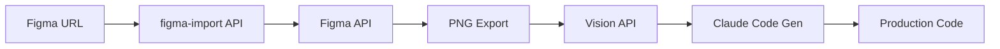

# 🎨 Figma Entegrasyonu Kurulum Rehberi

## 📋 Genel Bakış

ScreenToCode artık **gerçek Figma API** ile entegre! Figma tasarımlarınızı direkt olarak production-ready koda dönüştürün.

---

## ⚡ Hızlı Başlangıç

### 1. Figma Personal Access Token Alın

#### Adım 1: Figma Hesabınıza Giriş Yapın
- https://www.figma.com/ adresine gidin
- Hesabınıza giriş yapın

#### Adım 2: Token Oluşturun
1. Sağ üst köşedeki **profil resminize** tıklayın
2. **Settings** seçeneğine gidin
3. Sol menüden **"Personal Access Tokens"** bölümünü bulun
4. **"Generate new token"** butonuna tıklayın
5. Token'a bir isim verin (örn: "ScreenToCode API")
6. **"Generate token"** butonuna tıklayın
7. 🔑 **Token'ı kopyalayın** (bir daha gösterilmeyecek!)

#### Adım 3: Token'ı Projeye Ekleyin

`.env.local` dosyasını açın ve şu satırı ekleyin:

```bash
FIGMA_ACCESS_TOKEN=figd_YOUR_ACTUAL_TOKEN_HERE_xxxxxxxxxxxxx
```

**Örnek:**
```bash
FIGMA_ACCESS_TOKEN=figd_AbcD1234eFgH5678_ijKl9012mnOp3456qrSt7890uvWx
```

---

## 🎯 Figma Tasarımı Nasıl Import Edilir?

### Yöntem 1: Dosya URL'i ile Import

1. **Figma'da dosyanızı açın**
2. Sağ üst köşeden **"Share"** butonuna tıklayın
3. **"Copy link"** seçeneğini kullanın
4. ScreenToCode uygulamasına gidin
5. **"Figma Import"** butonuna tıklayın
6. URL'yi yapıştırın ve **"Import Et"** butonuna basın

**URL Formatı:**
```
https://www.figma.com/file/ABC123XYZ789/My-Design-File
```

### Yöntem 2: Belirli Bir Frame/Component Import

Belirli bir frame veya component'i import etmek için:

1. Figma'da **frame'i seçin**
2. Sağ tıklayın → **"Copy/Paste as" → "Copy link"**
3. URL şu formatta olacak:
```
https://www.figma.com/file/ABC123XYZ789/Design?node-id=123-456
```
4. Bu URL'yi ScreenToCode'a yapıştırın

**`node-id` parametresi** belirli bir frame'i export eder.

---

## 🔧 Teknik Detaylar

### API Endpoint: `/api/figma-import`

**Request:**
```typescript
POST /api/figma-import
{
  "figmaUrl": "https://www.figma.com/file/..."
}
```

**Response:**
```typescript
{
  "success": true,
  "imageUrl": "https://...",
  "fileName": "My Design",
  "fileKey": "ABC123XYZ789",
  "nodes": [...]
}
```

### İşleyiş Akışı



1. **Figma URL Parse**: File key ve node ID çıkarılır
2. **Figma API Call**: Metadata ve image export
3. **Vision Analysis**: GPT-4 Vision ile tasarım analizi
4. **Code Generation**: Claude 3.5 ile kod üretimi
5. **Output**: Seçili framework'te kod

---

## 🎨 Desteklenen Özellikler

### ✅ Import Edilebilen Elementler
- ✅ Frames
- ✅ Components
- ✅ Auto Layout
- ✅ Text Styles
- ✅ Colors & Gradients
- ✅ Images
- ✅ Icons
- ✅ Shapes

### ✅ Çıktı Formatları
- ✅ HTML + Tailwind CSS
- ✅ React + Tailwind
- ✅ Vue + Tailwind
- ✅ Svelte + Tailwind

---

## 🚨 Sık Karşılaşılan Sorunlar

### ❌ "Invalid Figma URL format"
**Neden:** URL formatı yanlış
**Çözüm:** URL şu formatta olmalı:
```
https://www.figma.com/file/{fileKey}/...
```

### ❌ "FIGMA_ACCESS_TOKEN not found"
**Neden:** Token environment variable'da yok
**Çözüm:** 
1. `.env.local` dosyasına token ekleyin
2. Sunucuyu yeniden başlatın: `npm run dev`

### ❌ "403 Forbidden" hatası
**Neden:** Token geçersiz veya dosyaya erişim yok
**Çözüm:**
1. Token'ın doğru kopyalandığından emin olun
2. Figma dosyasının **public** veya **token sahibine accessible** olduğundan emin olun
3. Yeni bir token oluşturun

### ⚠️ Mock Mode Aktif
**Neden:** Token yoksa otomatik mock mode aktif olur
**Çözüm:** Bu normal bir durumdur. Token eklemeden de test edebilirsiniz.

---

## 🔐 Güvenlik

### Token Güvenliği
- ⚠️ **ASLA** token'ı Git'e commitlemeyin
- ⚠️ **ASLA** token'ı frontend kodunda kullanmayın
- ✅ Token sadece server-side (API route) kullanılır
- ✅ `.env.local` dosyası `.gitignore`'da olmalı

### Figma Permissions
Token şu izinlere sahiptir:
- 📖 Read-only access
- 🖼️ File metadata
- 📸 Image export
- ❌ Write/delete access YOK

---

## 🎯 Best Practices

### Tasarım Hazırlığı
1. **Auto Layout kullanın** → Daha iyi responsive kod
2. **Component'leri organize edin** → Temiz kod yapısı
3. **Naming conventions** → Anlamlı class isimleri
4. **Color styles tanımlayın** → Tutarlı renk paleti

### Import Optimizasyonu
- ✅ Tek frame/component import edin (node-id ile)
- ✅ Basit tasarımlarla başlayın
- ✅ Kompleks animasyonlar → Manuel düzenleme gerekir
- ⚠️ Çok büyük dosyalar → Timeout riski

---

## 📊 Figma API Limitleri

Figma API rate limits:
- **100 requests / minute** (personal tokens)
- **1000 requests / hour**

ScreenToCode kullanımı:
- Her import = **2-3 API call**
- File metadata → 1 call
- Image export → 1 call

---

## 🚀 Production Kullanımı

### Environment Variables (Production)

```bash
# Vercel, Railway, vb. için
FIGMA_ACCESS_TOKEN=figd_your_production_token_here
OPENAI_API_KEY=sk_your_openai_key
CLAUDE_API_KEY=sk_ant_your_claude_key
```

### Monitoring

Log'ları kontrol edin:
```bash
# Success
✅ Figma imported: Design Name
📸 Image URL: https://...
👁️ Vision analysis complete
✨ Code generated successfully

# Error
❌ Figma API error: {...}
```

---

## 🆘 Destek

### Sorun mu yaşıyorsunuz?

1. **Console log'larını kontrol edin** (F12 → Console)
2. **Network tab'ı kontrol edin** (API çağrıları)
3. **Token'ın geçerli olduğundan emin olun**
4. **Figma dosyasının accessible olduğundan emin olun**

### Yardımcı Linkler
- 📘 [Figma API Docs](https://www.figma.com/developers/api)
- 🔑 [Personal Access Tokens](https://help.figma.com/hc/en-us/articles/8085703771159-Manage-personal-access-tokens)
- 💬 [Figma Community](https://forum.figma.com/)

---

## ✨ Örnekler

### Örnek 1: Landing Page
```
URL: https://www.figma.com/file/ABC123/Landing-Page
Output: React + Tailwind (responsive)
```

### Örnek 2: Component Library
```
URL: https://www.figma.com/file/XYZ789/Components?node-id=45-67
Output: HTML + Tailwind (tek component)
```

---

## 🎉 Sonuç

Artık Figma tasarımlarınızı **3 adımda** koda dönüştürebilirsiniz:

1. ✅ Token alın → `.env.local`'e ekleyin
2. ✅ Figma URL'i kopyalayın
3. ✅ Import edin → Kod hazır!

**Happy Coding! 🚀**
